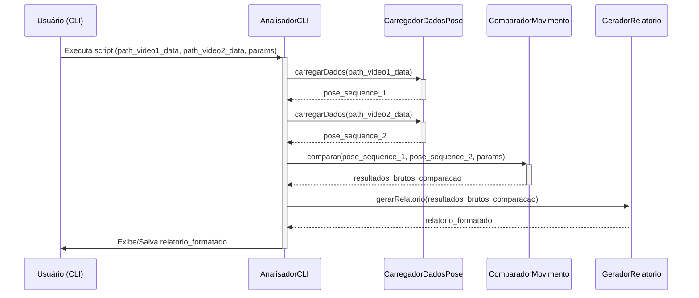

Absolutamente\! Chegou a hora de materializar todo esse planejamento.

Aqui está o seu **Documento de Arquitetura v0.1 (MVP para Demo)** para o projeto "Sistema de Análise Comparativa de Movimentos de Dança por Vídeo".

---

# Sistema de Análise Comparativa de Movimentos de Dança por Vídeo - Documento de Arquitetura v0.1 (MVP para Demo)

## 1\. Introdução / Preâmbulo

Este documento descreve a arquitetura técnica para o MVP (Produto Mínimo Viável) do TCC "Sistema de Análise Comparativa de Movimentos de Dança por Vídeo". O objetivo principal deste MVP é fornecer uma ferramenta de linha de comando (CLI) funcional capaz de carregar dados de pose de dois vídeos (pré-processados para extrair landmarks com MediaPipe), comparar os movimentos de dança e gerar um relatório textual simples indicando a similaridade. A arquitetura visa simplicidade e rapidez de implementação para atender à necessidade de uma demonstração funcional em 19 de maio de 2025. O sistema será desenvolvido em Python.

## 2\. Sumário Técnico

A arquitetura proposta para o MVP é uma aplicação Python CLI modular. O sistema receberá como entrada dois arquivos JSON contendo sequências de landmarks de pose (extraídos previamente via MediaPipe). Um módulo de comparação analisará esses landmarks utilizando algoritmos como similaridade de cosseno (e potencialmente DTW em iterações futuras) para avaliar a semelhança dos movimentos, considerando aspectos espaciais e temporais. A sensibilidade da análise será ajustável por parâmetros via CLI. Um módulo de relatório apresentará os resultados da comparação (um score de similaridade e possivelmente indicações de divergências) na saída do console e salvará em arquivo. A tecnologia principal é Python, com foco na biblioteca MediaPipe para a (pré)geração dos dados de pose.

## 3\. Visão Geral de Alto Nível

A arquitetura para o MVP do "Sistema de Análise Comparativa de Movimentos de Dança por Vídeo" será uma **aplicação Python modular executada via linha de comando (CLI)**. Ela seguirá um padrão de **pipeline de processamento de dados**, onde os dados de vídeo (na forma de arquivos de landmarks pré-extraídos) passam por estágios sequenciais de carregamento, comparação e geração de relatório.

O código-fonte será organizado em um **único repositório Git**.

O fluxo de dados e interação principal é o seguinte:

1.  O usuário executa o script principal Python via CLI, fornecendo os caminhos para dois arquivos JSON contendo os dados de pose (landmarks) previamente extraídos de dois vídeos. Parâmetros para a análise também podem ser fornecidos via CLI.
2.  O sistema carrega e valida os dados de pose desses dois arquivos.
3.  O módulo de comparação processa as duas sequências de pose, aplicando algoritmos (inicialmente focados em similaridade de cosseno e potencialmente DTW) para calcular um score de semelhança.
4.  O módulo de relatório formata os resultados da comparação.
5.  O relatório final é exibido no console para o usuário e salvo em um arquivo de texto.

<!-- end list -->

```mermaid
graph TD
    A[Usuário executa CLI com caminhos para dados de pose_A.json e pose_B.json + parâmetros] --> B{Script Principal Python};
    B --> C[Módulo de Carregamento de Dados]: Carrega pose_A e pose_B;
    C --> D[Módulo de Comparação de Movimentos]: Usa dados de pose_A, pose_B e parâmetros;
    D --> E[Módulo de Geração de Relatório]: Usa resultados da comparação;
    E --> F[Exibe Relatório no Console];
    E --> G[Salva Relatório em Arquivo];
```

## 4\. Padrões Arquiteturais / de Design Adotados

1.  **Pipeline de Processamento (Processing Pipeline):**
    - **Descrição:** O sistema operará como um pipeline, onde os dados (landmarks de pose) são processados em estágios sequenciais: Carregamento de Dados -\> Comparação de Movimentos -\> Geração de Relatório.
    - **Justificativa:** Ideal para tarefas de processamento de dados sequenciais, facilitando o entendimento e a manutenção.
2.  **Design Modular (Modular Design):**
    - **Descrição:** O código Python será organizado em módulos distintos com responsabilidades claras (ex: `carregamento_dados.py`, `algoritmo_comparacao.py`, `gerador_relatorio.py`, orquestrados por um script principal `analisador_cli.py`).
    - **Justificativa:** Promove a separação de responsabilidades, facilita testes (mesmo manuais) e melhora a manutenibilidade.
3.  **Interface de Linha de Comando (Command-Line Interface - CLI):**
    - **Descrição:** Interação exclusiva via linha de comando, usando argumentos para entradas e saída via console/arquivo.
    - **Justificativa:** Rapidez e simplicidade para o MVP e a demo, com foco na lógica principal.
4.  **Objetos de Transferência de Dados (Data Transfer Objects - DTOs) / Estruturas de Dados Simples:**
    - **Descrição:** Uso de estruturas de dados Python bem definidas (ex: listas de dicionários, dataclasses) para representar landmarks de pose e resultados da comparação, facilitando a comunicação entre módulos.
    - **Justificativa:** Garante consistência e clareza na passagem de dados.

## 5\. Visão de Componentes

Os componentes principais do sistema MVP CLI são:

1.  **`AnalisadorCLI` (Analisador/Orquestrador da Linha de Comando):**
    - **Responsabilidade:** Ponto de entrada do script; analisa argumentos da CLI; coordena a execução dos outros componentes; controla o fluxo geral; reporta status/erros básicos ao console.
2.  **`CarregadorDadosPose` (Carregador de Dados de Pose):**
    - **Responsabilidade:** Recebe caminhos de arquivos JSON; carrega os dados de landmarks de pose; valida a estrutura básica dos dados; disponibiliza as sequências de pose.
3.  **`ComparadorMovimento` (Comparador de Movimento):**
    - **Responsabilidade:** Recebe duas sequências de dados de pose e parâmetros de análise; implementa o(s) algoritmo(s) de comparação (ex: DTW, similaridade de cosseno); calcula e retorna resultados brutos da comparação.
4.  **`GeradorRelatorio` (Gerador de Relatório):**
    - **Responsabilidade:** Recebe resultados brutos da comparação; formata-os em um relatório textual legível; exibe o relatório no console; salva o relatório em arquivo.

**Colaboração entre Componentes:**



## 6\. Estrutura do Projeto

```plaintext
{raiz_do_projeto}/
├── .git/
├── .gitignore
├── venv/                     # Ambiente virtual Python (recomendado)
├── docs/
│   ├── PRD_AnaliseDanca.md
│   └── Arquitetura_AnaliseDanca.md # Este documento
├── reports/                  # Diretório para salvar os relatórios de comparação
├── src/                      # Código fonte principal
│   ├── __init__.py
│   ├── analisador_cli.py     # Ponto de entrada, AnalisadorCLI
│   ├── carregamento_dados.py # CarregadorDadosPose
│   ├── comparador_movimento.py # ComparadorMovimento
│   ├── gerador_relatorio.py  # GeradorRelatorio
│   └── utils.py              # (Opcional) Funções utilitárias
├── tests/
│   └── videos_teste/         # Para seus vídeos de teste
│       ├── video_ref_01.mp4
│       └── video_teste_01.mp4
├── requirements.txt          # Dependências Python
└── README.md                 # Instruções do projeto
```

## 7\. Referência de APIs

### APIs Externas Consumidas

- **Biblioteca:** MediaPipe (por Google)
  - **Propósito:** Utilizada para a estimativa de pose (pré-processamento para gerar os arquivos JSON de landmarks que são entrada para este sistema).
  - **Módulos Principais (usados na etapa de pré-processamento):** `mediapipe.solutions.pose` (Pose Landmarker).
  - **Saída Gerada (pelo pré-processamento, e entrada para este sistema):** Arquivos JSON contendo landmarks de pose (coordenadas x, y, z, visibilidade).
  - **Licença:** Apache 2.0.
  - **Link para Documentação Oficial:** [https://developers.google.com/mediapipe/solutions/vision/pose_landmarker](https://developers.google.com/mediapipe/solutions/vision/pose_landmarker)

### APIs Internas Fornecidas

Para o MVP CLI, o sistema não exporá APIs internas para consumo externo. A interação é via módulos Python.

## 8\. Modelos de Dados

### Entidades Principais da Aplicação / Objetos de Domínio

#### `Landmark` (Ponto-Chave de Pose)

- **Descrição:** Representa um único ponto-chave detectado no corpo em um frame.
- **Estrutura (Exemplo via `dataclasses`):**

  ```python
  from dataclasses import dataclass
  from typing import Optional

  @dataclass
  class Landmark:
      index: int
      name: Optional[str]
      x: float
      y: float
      z: Optional[float] = None
      visibility: Optional[float] = None
  ```

#### `FramePoseData` (Dados de Pose de um Frame)

- **Descrição:** Todos os landmarks de pose detectados para uma pessoa em um único frame.
- **Estrutura (Exemplo via `dataclasses`):**

  ```python
  from typing import List

  @dataclass
  class FramePoseData:
      frame_number: int
      timestamp_ms: Optional[int]
      landmarks: List[Landmark]
  ```

#### `VideoPoseSequence` (Sequência de Poses de um Vídeo - Conteúdo do JSON de Entrada)

- **Descrição:** Sequência completa de `FramePoseData` para um vídeo.
- **Estrutura (JSON):** Uma lista de objetos `FramePoseData`.
  ```json
  [
    {
      "frame_number": 0,
      "timestamp_ms": 0,
      "landmarks": [
        {
          "index": 0,
          "name": "nose",
          "x": 0.5,
          "y": 0.2,
          "z": -0.1,
          "visibility": 0.99
        } /* ... */
      ]
    },
    {
      "frame_number": 1,
      "timestamp_ms": 33,
      "landmarks": [
        {
          "index": 0,
          "name": "nose",
          "x": 0.51,
          "y": 0.22,
          "z": -0.12,
          "visibility": 0.98
        } /* ... */
      ]
    }
  ]
  ```

### Estrutura do Resultado da Comparação (Conceitual Interna)

- **Descrição:** Estrutura para manter os resultados da comparação antes da formatação.
- **Estrutura (Exemplo Python):**
  ```python
  # comparison_result = {
  #     "overall_similarity_score": 0.85,
  #     "segments_of_agreement": [ /* ... */ ],
  #     "segments_of_divergence": [ /* ... */ ],
  #     "config_params_used": { /* ... */ }
  # }
  ```

## 9\. Fluxos de Trabalho Principais / Diagramas de Sequência

O fluxo principal de comparação de dois vídeos (a partir dos dados de pose já extraídos) é:


## 10\. Seleções Definitivas da Pilha Tecnológica

| Categoria          | Tecnologia          | Versão / Detalhes                      | Descrição / Propósito                                             | Justificativa (Opcional)                             |
| :----------------- | :------------------ | :------------------------------------- | :---------------------------------------------------------------- | :--------------------------------------------------- |
| **Linguagens**     | Python              | 3.9+ (Recomendado: 3.11.x)             | Linguagem principal para desenvolvimento.                         | Bibliotecas de CV/dados; familiaridade.              |
| **Bibliotecas CV** | MediaPipe (Google)  | Última estável via PyPI (ex: `0.10.x`) | Usado no pré-processamento para gerar arquivos JSON de landmarks. | Facilidade, licença Apache 2.0, desempenho para MVP. |
|                    | OpenCV (cv2)        | Última estável (dependência comum)     | Manipulação de vídeo (na etapa de pré-processamento).             | Interoperabilidade.                                  |
| **Dados**          | NumPy               | Última estável                         | Manipulação de arrays numéricos (landmarks).                      | Fundamental para dados em Python.                    |
| **CLI**            | `argparse` (Python) | Módulo padrão Python                   | Análise de argumentos da CLI.                                     | Integrado, simples para MVP.                         |
| **Versionamento**  | Git                 | Última estável                         | Controle de versão.                                               | Padrão da indústria.                                 |
| **Empacotamento**  | `requirements.txt`  | N/A                                    | Especificação de dependências Python.                             | Método padrão Python.                                |

**Nota:** Versões exatas devem ser fixadas no `requirements.txt` durante a configuração do ambiente (Estória 1.1 do PRD).

## 11\. Visão Geral da Infraestrutura e Implantação

- **Provedor(es) de Nuvem/Serviços/IaC:** Não aplicável para o MVP (execução local).
- **Estratégia de Implantação:** Clonar repo, configurar ambiente Python via `requirements.txt`, executar script principal via CLI.
- **Ambientes:** Desenvolvimento/execução local.
- **Estratégia de Rollback (Código):** Via Git.

## 12\. Estratégia de Tratamento de Erros

- **Abordagem Geral:** Exceções Python, mensagens de erro claras no console, encerramento controlado.
- **Logging (MVP):** `print()` para status/erros; módulo `logging` (nível ERROR) para depuração mais crítica.
- **Padrões Específicos:** Validação de caminhos de arquivo, formato JSON, parâmetros CLI. Tratamento de falhas na detecção de pose (pelo MediaPipe na fase de pré-processamento) e no algoritmo de comparação, informando o usuário. Erros ao salvar relatório serão notificados, mas a exibição no console será tentada.

## 13\. Padrões de Codificação

- **Linguagem Principal:** Python (3.9+).
- **Guia de Estilo e Linter:** PEP 8. Recomenda-se Black (formatação) e Flake8 (linting).
- **Convenções de Nomenclatura:** `snake_case` para variáveis/funções/módulos, `PascalCase` para classes, `UPPER_SNAKE_CASE` para constantes.
- **Type Hints:** Fortemente recomendado para todas as definições de função/método.
- **Docstrings:** Mandatório para módulos, classes e funções públicas (ex: Google Style).
- **Gerenciamento de Dependências:** `pip` e `requirements.txt` com versões fixadas.
- **Idiomas Python:** Uso de construções idiomáticas, `with` para recursos.

## 14\. Estratégia Geral de Testes

- **Ferramentas (MVP):** Execução direta de scripts Python, observação manual de saídas, conjunto de vídeos de teste.
- **Testes Unitários/Integração (MVP):** Não automatizados formalmente. Validação manual da lógica dos módulos e interações durante o desenvolvimento e testes E2E manuais.
- **Testes de Ponta a Ponta (E2E) (MVP):** Execução completa do CLI com vídeos de teste, análise manual da plausibilidade do relatório. A demo de 19 de maio de 2025 será um teste E2E prático.
- **Gerenciamento de Dados de Teste:** Seleção de vídeos de teste pelo estudante; arquivos JSON de landmarks gerados serão os dados de teste para comparação.

## 15\. Melhores Práticas de Segurança

- **Validação de Entrada:** Validar caminhos de arquivo, tratar exceções de JSON malformado, validar parâmetros da CLI.
- **Segurança de Dependências:** Usar PyPI oficial, manter dependências atualizadas (com versões fixadas para TCC).
- **Tratamento de Erros:** Não expor detalhes sensíveis em mensagens de erro ao usuário.
- **Ambiente de Desenvolvimento:** Uso de `venv`, não versionar informações sensíveis.
- **Dados de Vídeo:** Manusear vídeos de teste com respeito à privacidade.

## 16\. Documentos Chave de Referência

- Documento de Requisitos do Produto (PRD) - `PRD_AnaliseDanca.md`
- Relatório de Pesquisa fornecido pelo usuário - `relatorio-pesquisa.txt`

## 17\. Registro de Alterações (Change Log)

| Data       | Versão | Descrição                                                   | Autor       |
| :--------- | :----- | :---------------------------------------------------------- | :---------- |
| 2025-05-19 | 0.1    | Versão inicial do Documento de Arquitetura (MVP para Demo). | Fred (Arq.) |

---

**Sumário da Validação do Checklist do Arquiteto (`architect-checklist`)**

A arquitetura proposta foi avaliada em relação ao `architect-checklist` e todas as seções aplicáveis foram consideradas como "PASSOU", com as devidas adaptações para o escopo de um TCC MVP CLI.

| Categoria                                        | Status    | Observações / Problemas Críticos                                    |
| :----------------------------------------------- | :-------- | :------------------------------------------------------------------ |
| 1. Alinhamento de Requisitos                     | ✅ PASSOU | Nenhum problema crítico identificado.                               |
| 2. Fundamentos da Arquitetura                    | ✅ PASSOU | Nenhum problema crítico identificado.                               |
| 3. Pilha Tecnológica e Decisões                  | ✅ PASSOU | N/A para vários itens devido à natureza CLI do MVP.                 |
| 4. Resiliência e Prontidão Operacional           | ✅ PASSOU | N/A ou simplificado para vários itens devido à natureza CLI do MVP. |
| 5. Segurança e Conformidade                      | ✅ PASSOU | Maioria dos itens N/A devido à natureza local e escopo do MVP.      |
| 6. Orientação para Implementação                 | ✅ PASSOU | Nenhum problema crítico identificado.                               |
| 7. Gerenciamento de Dependências e Integração    | ✅ PASSOU | N/A para integrações com terceiros no MVP.                          |
| 8. Adequação para Implementação por Agente de IA | ✅ PASSOU | Nenhum problema crítico identificado.                               |

**Conclusão do Checklist:** A arquitetura proposta é considerada adequada, clara e suficientemente detalhada para guiar o desenvolvimento do MVP do TCC, especialmente considerando a necessidade de uma demo funcional em curto prazo.

---

Aí está\! Este é o Documento de Arquitetura v0.1 (MVP para Demo). Ele deve fornecer um roteiro técnico claro para você construir seu TCC.

Minha tarefa de criar a arquitetura com você está concluída. Lembre-se de que este é um documento vivo; se os requisitos mudarem significativamente ou se você encontrar grandes desafios técnicos, podemos revisitar e ajustar a arquitetura (provavelmente após consultar o Product Owner ou o Scrum Master para gerenciar a mudança).

Desejo muito sucesso com sua demo e o desenvolvimento do seu TCC\! Fred (Arquiteto) desligando\!
