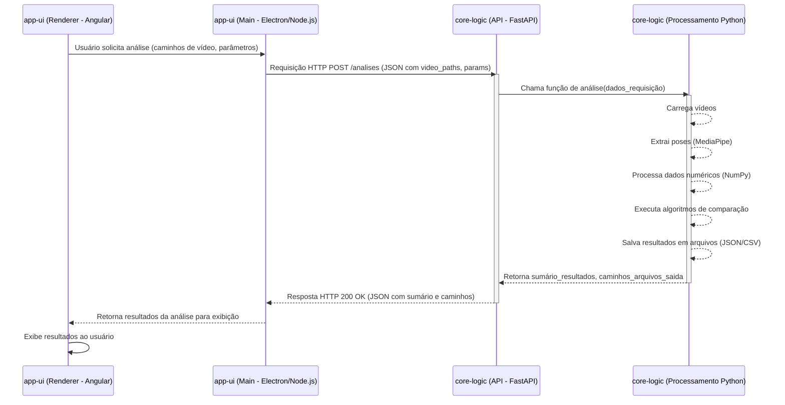

# Sistema de Análise Comparativa de Movimentos de Dança para TCC Architecture Document

## Documentos de Referência

- [Documento de Produto](docs/Product.md) - Requisitos e especificações do produto
- [Documento de Arquitetura do Frontend](docs/Frontend-Architecture.md) - Detalhes técnicos e decisões de arquitetura do frontend

## Introduction / Preamble

Este documento descreve a arquitetura geral do projeto "Sistema de Análise Comparativa de Movimentos de Dança para TCC". Seu objetivo principal é servir como o projeto arquitetural orientador para o desenvolvimento, garantindo consistência e aderência às tecnologias e padrões escolhidos. Dado que a aplicação possui uma interface de usuário significativa gerenciada pelo Electron e Angular, e uma lógica de processamento principal em Python, este documento cobrirá a interação entre esses componentes e as decisões arquiteturais chave.

## Technical Summary

O Sistema de Análise Comparativa de Movimentos de Dança para TCC é uma aplicação desktop projetada para permitir que pesquisadores analisem e comparem movimentos de dança a partir de vídeos. A arquitetura é baseada em um **monorepo** contendo dois componentes principais:

1.  Um frontend **`app-ui`**, construído com **Electron e Angular (LTS)**, responsável pela interface do usuário, seleção de vídeo, entrada de parâmetros e exibição de resultados.
2.  Uma lógica de processamento principal **`core-logic`**, desenvolvida em **Python (v3.8+)**, que expõe uma **API HTTP local usando FastAPI**. Esta API será responsável por receber os dados do frontend, utilizar a biblioteca **MediaPipe** para extração de pose, **NumPy** para manipulação de dados numéricos, realizar as análises comparativas e retornar os resultados.

A comunicação entre o `app-ui` e o `core-logic` (servidor FastAPI) ocorrerá via chamadas HTTP locais. O `app-ui` (Electron) gerenciará o ciclo de vida do servidor `core-logic` (FastAPI). Os resultados das análises serão armazenados localmente em arquivos (JSON, CSV). A aplicação é destinada para implantação e execução local em máquinas desktop padrão, com foco na facilidade de uso para o pesquisador e na modularidade da lógica de análise para futuras expansões.

## High-Level Overview

A arquitetura adotada é a de uma **aplicação desktop monolítica em termos de implantação, mas com separação de processos para o frontend e a lógica de backend**. A estrutura do projeto será um **monorepo**.

O fluxo principal de interação do usuário é o seguinte:

1.  O usuário interage com a interface `app-ui` (Electron/Angular) para carregar vídeos e definir parâmetros de análise.
2.  O `app-ui`, através de seu processo principal Node.js, garante que o servidor `core-logic` (FastAPI em Python) esteja em execução. Se não estiver, o `app-ui` o iniciará.
3.  O frontend (processo renderer do Electron) envia os dados do vídeo (provavelmente o caminho do arquivo) e os parâmetros de análise para a API local exposta pelo `core-logic` via uma requisição HTTP.
4.  O `core-logic` (FastAPI) processa a requisição:
    - Utiliza o MediaPipe para extrair dados de pose dos vídeos.
    - Utiliza NumPy para cálculos e manipulação dos dados de pose.
    - Executa os algoritmos de análise comparativa.
    - Salva os resultados detalhados em arquivos (JSON, CSV) e retorna um resumo ou caminho dos resultados para o `app-ui`.
5.  O `app-ui` exibe os resultados recebidos para o usuário.
6.  Ao fechar o `app-ui`, o processo principal do Electron se encarregará de finalizar o servidor `core-logic`.

A seguir, um diagrama conceitual simples ilustrando essa interação:

```mermaid
graph TD
    Usuario[Usuário] --> IU_ElectronAngular[app-ui (Electron/Angular)]
    IU_ElectronAngular -- "1. Inicia/Verifica Servidor Python" --> ServidorPython[core-logic (Servidor FastAPI)]
    IU_ElectronAngular -- "2. Envia Dados (Vídeo/Parâmetros) via HTTP" --> ServidorPython
    ServidorPython -- "3. Processa (MediaPipe, NumPy, Análise)" --> ServidorPython
    ServidorPython -- "4. Salva Resultados (JSON/CSV)" --> SistemaArquivos[Sistema de Arquivos Local]
    ServidorPython -- "5. Retorna Sumário/Caminho via HTTP" --> IU_ElectronAngular
    IU_ElectronAngular -- "6. Exibe Resultados" --> Usuario
    IU_ElectronAngular -- "7. Ao fechar, finaliza Servidor Python" --> ServidorPython
```

## Component View

Esta seção detalhará os principais componentes lógicos do sistema, suas responsabilidades e como eles colaboram.

- **Componente 1: `app-ui` (Frontend - Electron/Angular)**

  - **Responsabilidades:**
    - Prover a interface gráfica do usuário (GUI) para todas as interações.
    - Gerenciar a seleção de arquivos de vídeo pelo usuário.
    - Coletar parâmetros de análise definidos pelo usuário.
    - Gerenciar o ciclo de vida do servidor `core-logic` (FastAPI):
      - **Inicialização:** Ao iniciar o `app-ui`, o processo principal do Electron verificará se o servidor `core-logic` está rodando. Se não estiver, ele o iniciará como um processo filho. Isso envolverá executar o script Python que serve a aplicação FastAPI. O `app-ui` deve aguardar uma confirmação de que o servidor Python iniciou com sucesso (ex: o servidor Python pode escrever uma mensagem específica no `stdout` ao iniciar, ou o `app-ui` pode tentar fazer uma chamada a um endpoint de "health check" no servidor FastAPI).
      - **Comunicação:** Enviar requisições HTTP para a API do `core-logic` (ex: para `/analisar_video`, `/status_servidor`, etc.) contendo os caminhos dos vídeos e os parâmetros de análise.
      - **Recepção de Dados:** Receber as respostas HTTP do `core-logic`, que podem incluir dados de sumário da análise, status, ou caminhos para os arquivos de resultado.
      - **Exibição de Resultados:** Apresentar os resultados da análise ao usuário de forma compreensível.
      - **Finalização:** Ao fechar o `app-ui`, o processo principal do Electron deve garantir que o processo do servidor `core-logic` seja finalizado de forma limpa para evitar processos órfãos. Isso pode ser feito enviando um sinal de término ao processo filho.
    - Lidar com a configuração da aplicação (ex: porta do servidor `core-logic`, se configurável).
  - **Tecnologias Chave:** Electron, Angular (LTS), Node.js (para o processo principal do Electron), HTML, CSS, TypeScript.

- **Componente 2: `core-logic` (Backend - Servidor Python/FastAPI)**

  - **Responsabilidades:**
    - Expor uma API HTTP local (FastAPI) com endpoints claramente definidos para as funcionalidades de análise.
      - Ex: `POST /analises`: recebe caminho do vídeo e parâmetros, inicia a análise, retorna um ID de job ou resultados diretos se síncrono.
      - Ex: `GET /status`: retorna o status operacional do servidor.
    - Realizar o processamento principal da análise de movimento:
      - Carregar e processar os arquivos de vídeo.
      - Utilizar a biblioteca MediaPipe para extração de dados de pose.
      - Utilizar a biblioteca NumPy para manipulação de dados numéricos e cálculos.
      - Implementar os algoritmos específicos para a análise comparativa de movimentos de dança.
    - Gerenciar o armazenamento dos resultados das análises em arquivos locais (JSON, CSV), conforme especificado nos requisitos.
    - Realizar validação dos dados de entrada recebidos via API.
    - Lidar com erros durante o processamento e retornar respostas de erro apropriadas via API.
  - **Tecnologias Chave:** Python (v3.8+), FastAPI, MediaPipe, NumPy, Uvicorn (servidor ASGI para FastAPI).

Abaixo, um diagrama de componentes mais detalhado ilustrando as responsabilidades e a interface de comunicação:

```mermaid
graph TD
    subgraph app-ui [app-ui (Electron/Angular)]
        direction LR
        ElectronMain[Processo Principal (Node.js)]
        ElectronRenderer[Processo Renderer (Angular UI)]

        ElectronMain -- "Gerencia Ciclo de Vida" --> CoreLogicServer
        ElectronMain -- "IPC (Coordenação Interna)" --> ElectronRenderer
        ElectronRenderer -- "Requisições HTTP API (localhost)" --> CoreLogicServer
    end

    subgraph core-logic [core-logic (Python/FastAPI)]
        direction LR
        CoreLogicServer[Servidor FastAPI]
        MediaPipeModule[Módulo MediaPipe]
        NumPyModule[Módulo NumPy]
        AnalysisAlgorithms[Algoritmos de Análise]
        FileStorage[Módulo de Armazenamento (JSON/CSV)]

        CoreLogicServer -- "Usa" --> MediaPipeModule
        CoreLogicServer -- "Usa" --> NumPyModule
        CoreLogicServer -- "Usa" --> AnalysisAlgorithms
        AnalysisAlgorithms -- "Salva/Lê" --> FileStorage
    end

    SistemaArquivosLocal[Sistema de Arquivos Local]
    FileStorage --> SistemaArquivosLocal
```

## Architectural / Design Patterns Adopted

Para guiar o desenvolvimento e garantir uma estrutura coesa, alguns padrões arquiteturais e de design serão adotados:

- **Padrão 1: Cliente-Servidor (Local)**

  - **Descrição:** O `app-ui` (Electron/Angular) atua como um cliente para o `core-logic` (servidor FastAPI). Embora ambos rodem na mesma máquina, essa separação permite um desacoplamento claro das responsabilidades da interface do usuário e da lógica de processamento pesada.
  - **Justificativa:** Facilita o desenvolvimento, teste e manutenção independentes dos componentes. Permite que o `core-logic` seja potencialmente reutilizado ou acessado por outros meios no futuro (embora não seja um requisito atual). A comunicação via API HTTP é um padrão bem compreendido.

- **Padrão 2: Monorepo**

  - **Descrição:** Todo o código fonte para o `app-ui` e o `core-logic` residirá em um único repositório Git.
  - **Justificativa:** Conforme decisão inicial. Simplifica o gerenciamento de dependências entre os projetos (se houver no futuro), a configuração do build e a consistência geral do projeto, especialmente para uma equipe pequena ou um único desenvolvedor (como é comum em TCCs).

- **Padrão 3: API RESTful (para `core-logic`)**

  - **Descrição:** O `core-logic` exporá seus serviços através de uma API seguindo os princípios RESTful, utilizando FastAPI.
  - **Justificativa:** Fornece uma interface padronizada e bem definida para a comunicação. FastAPI facilita a criação de APIs robustas com validação de dados e documentação automática.

- **Padrão 4: Processamento Assíncrono (para operações de análise no `core-logic`)**

  - **Descrição:** Para análises de vídeo que podem ser demoradas, a API do `core-logic` implementará um padrão assíncrono usando `BackgroundTasks` do FastAPI e um sistema de filas simples em memória. O frontend iniciará uma análise e poderá consultar o status ou ser notificado da conclusão.
  - **Justificativa:** Evita que a interface do usuário (`app-ui`) fique bloqueada esperando por operações longas, melhorando a experiência do usuário. FastAPI suporta nativamente operações assíncronas (`async/await`).
  - **Implementação:**

    ```python
    from fastapi import BackgroundTasks, HTTPException
    from typing import Dict
    import asyncio
    from datetime import datetime

    # Estrutura para armazenar jobs em memória
    jobs: Dict[str, Dict] = {}

    @app.post("/analises")
    async def criar_analise(
        request: AnaliseRequest,
        background_tasks: BackgroundTasks
    ) -> AnaliseResponse:
        # Gera ID único para o job
        job_id = str(uuid.uuid4())

        # Inicializa status do job
        jobs[job_id] = {
            "status": "pendente",
            "created_at": datetime.now(),
            "result": None,
            "error": None
        }

        # Adiciona tarefa ao background
        background_tasks.add_task(
            processar_analise,
            job_id=job_id,
            request=request
        )

        return {
            "status": "sucesso",
            "mensagem": "Análise iniciada com sucesso",
            "job_id": job_id
        }

    @app.get("/analises/{job_id}")
    async def obter_status_analise(job_id: str) -> AnaliseStatusResponse:
        if job_id not in jobs:
            raise HTTPException(status_code=404, detail="Job não encontrado")

        job = jobs[job_id]
        return {
            "status": job["status"],
            "result": job["result"],
            "error": job["error"],
            "created_at": job["created_at"]
        }

    async def processar_analise(job_id: str, request: AnaliseRequest):
        try:
            jobs[job_id]["status"] = "processando"

            # Processamento da análise
            resultado = await analisar_videos(request)

            jobs[job_id].update({
                "status": "concluido",
                "result": resultado
            })
        except Exception as e:
            jobs[job_id].update({
                "status": "erro",
                "error": str(e)
            })
    ```

  - **Fluxo de Processamento Assíncrono:**

    ```mermaid
    sequenceDiagram
        participant AppUI as app-ui (Frontend)
        participant API as core-logic (FastAPI)
        participant Background as Background Task
        participant Storage as Job Storage

        AppUI->>API: POST /analises (dados da análise)
        API->>Storage: Cria novo job
        API-->>AppUI: Retorna job_id (202 Accepted)

        loop Polling Status
            AppUI->>API: GET /analises/{job_id}
            API->>Storage: Consulta status
            API-->>AppUI: Retorna status atual
        end

        Note over Background: Processamento em background
        Background->>Storage: Atualiza status
        Background->>Storage: Salva resultados

        AppUI->>API: GET /analises/{job_id}
        API->>Storage: Consulta resultados
        API-->>AppUI: Retorna resultados completos
    ```

  - **Considerações de Implementação:**
    - Para produção, considerar migrar para Celery + Redis/RabbitMQ
    - Implementar limpeza periódica de jobs antigos
    - Adicionar timeout para jobs pendentes
    - Considerar persistência de jobs em caso de reinicialização do servidor

- **Padrão 5: Ambiente Virtualizado para Dependências Python (`venv`)**

  - **Descrição:** O ambiente de execução do `core-logic` e suas dependências (FastAPI, MediaPipe, NumPy, etc.) serão gerenciados usando `venv` e um arquivo `requirements.txt`.
  - **Justificativa:** Garante isolamento das dependências do projeto, reprodutibilidade do ambiente de desenvolvimento e evita conflitos com outras instalações Python no sistema do usuário.

## Project Structure

A estrutura de pastas do projeto, baseada na proposta do PRD, será a seguinte. Esta estrutura organiza o frontend (`app-ui`), a lógica principal (`core-logic`), saídas de resultados, scripts e documentação dentro de um monorepo.

```plaintext
{project-root}/
├── app-ui/                 # Aplicação Frontend (Electron + Angular)
│   ├── src/                # Código fonte do Angular
│   ├── main.js             # Ponto de entrada principal do Electron (Processo Principal)
│   ├── preload.js          # Script de preload do Electron (para comunicação segura renderer <-> main)
│   └── package.json        # Dependências e scripts do Node/Electron/Angular
├── core-logic/             # Lógica principal em Python (Servidor FastAPI)
│   ├── app/                # Código da aplicação FastAPI aqui (main.py, routers, etc.)
│   ├── video_processing/   # Módulo para carregar vídeo, extrair frames
│   ├── pose_estimation/    # Módulo para integração com MediaPipe, normalização
│   ├── comparison/         # Módulo para representação de pose, DTW, métricas de similaridade, ritmo
│   ├── results_management/ # Módulo para salvar/carregar resultados (arquivos)
│   └── utils/              # Utilitários gerais para o core (ex: cálculos de ângulo)
├── results-output/         # Diretório padrão para salvar os arquivos de resultado gerados
├── scripts/                # Scripts auxiliares (ex: para testes, conversão de dados, etc.)
├── docs/                   # Documentação do projeto
│   └── TCC_Frontend_Spec_UIUX_v1.0.txt # Especificação de UI/UX
├── main_core_entry.py      # Script Python de entrada para iniciar o servidor FastAPI do core-logic
├── requirements.txt        # Dependências Python (FastAPI, uvicorn, MediaPipe, NumPy, OpenCV-python, etc.)
└── README.md               # Documentação principal do projeto
```

#### Key Directory Descriptions

- **`app-ui/`**: Contém toda a aplicação frontend baseada em Electron e Angular.
  - `app-ui/src/`: Código fonte da aplicação Angular.
  - `app-ui/main.js`: Script do processo principal do Electron.
  - `app-ui/preload.js`: Script de preload do Electron.
- **`core-logic/`**: Contém toda a lógica de backend em Python, estruturada como um servidor FastAPI.
  - `core-logic/app/`: Onde a aplicação FastAPI e seus endpoints são definidos.
  - `core-logic/video_processing/`, `core-logic/pose_estimation/`, etc.: Módulos especializados para as diferentes etapas do processamento de análise de dança.
- **`results-output/`**: Diretório padrão onde os arquivos de resultado (JSON, CSV) gerados pelas análises serão armazenados.
- **`scripts/`**: Scripts utilitários para desenvolvimento, teste ou tarefas de manutenção.
- **`docs/`**: Armazena toda a documentação do projeto, incluindo a especificação de UI/UX (`TCC_Frontend_Spec_UIUX_v1.0.txt`).
- **`main_core_entry.py`**: Ponto de entrada para iniciar o servidor FastAPI do `core-logic`.
- **`requirements.txt`**: Lista as dependências Python do projeto.

## API Reference

Esta seção descreve as APIs consumidas e fornecidas pelo sistema. Para este projeto, o foco principal é a API interna fornecida pelo `core-logic`.

#### External APIs Consumed

- Não há APIs externas consumidas por este sistema no momento.

#### Internal APIs Provided

##### `core-logic` API (Servidor FastAPI)

- **Propósito:** Esta API interna expõe as funcionalidades de processamento e análise de movimentos de dança do `core-logic` para serem consumidas pelo frontend `app-ui` (Electron/Angular). Ela permite que o frontend solicite análises de vídeo, envie os parâmetros necessários e receba os resultados.

- **Base URL:** `http://localhost:PORTA_DO_FASTAPI`

  - _Nota: `PORTA_DO_FASTAPI` será uma porta configurável. O `app-ui` (Electron) precisará saber qual porta usar, seja por uma configuração padrão, descobrindo uma porta livre e passando-a para o servidor Python ao iniciá-lo, ou o servidor Python tentando uma porta padrão e informando ao Electron. Para fins deste documento, assumiremos `8008` como porta padrão, mas isso deve ser configurável._

- **Autenticação/Autorização:** Nenhuma autenticação complexa é planejada para esta API interna, pois ela é destinada a ser acessada apenas localmente pelo `app-ui`. O servidor FastAPI só aceitará conexões de `localhost`.

- **Endpoints:**

  - **`POST /analises`**

    - **Descrição:** Submete um ou mais vídeos e os parâmetros de análise para processamento. Inicialmente, a análise será síncrona.
    - **Request Body Schema:** O corpo da requisição será um JSON conforme o modelo Pydantic `AnaliseRequest`.
    - **Success Response Schema (Código: `200 OK`):** O corpo da resposta será um JSON conforme o modelo Pydantic `AnaliseResponse`.
    - **Error Response Schema (Códigos: `4xx`, `5xx`):** FastAPI fornecerá uma resposta JSON padrão para erros.

  - **`GET /status`**

    - **Descrição:** Endpoint simples para o `app-ui` verificar se o servidor `core-logic` está ativo e respondendo.
    - **Request Body Schema:** N/A
    - **Success Response Schema (Código: `200 OK`):** O corpo da resposta será um JSON conforme o modelo Pydantic `StatusServidorResponse`.

### Exemplos de Respostas de Erro

#### 1. Erro de Validação (400 Bad Request)

```json
{
  "detail": [
    {
      "loc": ["body", "video_principal_path"],
      "msg": "field required",
      "type": "value_error.missing"
    },
    {
      "loc": ["body", "parametros_analise", "sensibilidade_dtw"],
      "msg": "ensure this value is less than or equal to 1.0",
      "type": "value_error.number.not_le",
      "ctx": { "limit_value": 1.0 }
    }
  ]
}
```

#### 2. Arquivo de Vídeo Não Encontrado (404 Not Found)

```json
{
  "detail": "Arquivo de vídeo não encontrado: /caminho/para/video.mp4"
}
```

#### 3. Erro de Processamento (500 Internal Server Error)

```json
{
  "detail": "Erro ao processar vídeo: formato não suportado"
}
```

#### 4. Job Não Encontrado (404 Not Found)

```json
{
  "detail": "Job não encontrado: 123e4567-e89b-12d3-a456-426614174000"
}
```

#### 5. Job em Progresso (409 Conflict)

```json
{
  "detail": "Job ainda em processamento: 123e4567-e89b-12d3-a456-426614174000"
}
```

### Códigos de Status HTTP

| Código | Descrição             | Uso                                       |
| ------ | --------------------- | ----------------------------------------- |
| 200    | OK                    | Resposta bem-sucedida                     |
| 202    | Accepted              | Análise iniciada (assíncrona)             |
| 400    | Bad Request           | Erro de validação dos parâmetros          |
| 404    | Not Found             | Recurso não encontrado                    |
| 409    | Conflict              | Conflito de estado (ex: job em progresso) |
| 500    | Internal Server Error | Erro interno do servidor                  |

## Data Models

#### API Payload Schemas (Modelos Pydantic para FastAPI)

- **`AnaliseParameters`**

  ```python
  from pydantic import BaseModel, Field, confloat
  from typing import Optional, List

  class AnaliseParameters(BaseModel):
      # Campos obrigatórios
      # Nenhum campo obrigatório no momento

      # Campos opcionais com valores padrão
      sensibilidade_dtw: Optional[float] = Field(
          default=0.5,
          ge=0.0,
          le=1.0,
          description="Sensibilidade para o algoritmo DTW. Valor entre 0.0 e 1.0."
      )
      limiar_similaridade: Optional[float] = Field(
          default=0.8,
          ge=0.0,
          le=1.0,
          description="Limiar de similaridade para considerar movimentos como 'semelhantes'. Valor entre 0.0 e 1.0."
      )

      # Campos opcionais sem valor padrão
      frames_por_segundo_analise: Optional[int] = Field(
          default=None,
          gt=0,
          description="Forçar análise a X FPS. Se None, usa o FPS original do vídeo."
      )

      class Config:
          schema_extra = {
              "example": {
                  "sensibilidade_dtw": 0.5,
                  "limiar_similaridade": 0.8,
                  "frames_por_segundo_analise": None
              }
          }
  ```

- **`AnaliseRequest`**

  ```python
  from pydantic import BaseModel, Field
  from typing import List, Optional

  class AnaliseRequest(BaseModel):
      video_principal_path: str = Field(..., description="Caminho absoluto para o arquivo do vídeo principal a ser analisado.")
      videos_comparacao_paths: Optional[List[str]] = Field(None, description="Lista opcional de caminhos absolutos para vídeos de comparação.")
      parametros_analise: AnaliseParameters = Field(default_factory=AnaliseParameters, description="Parâmetros para a análise.")
  ```

- **`ResultadoComparacaoItem`**

  ```python
  from pydantic import BaseModel
  from typing import Optional

  class ResultadoComparacaoItem(BaseModel):
      video_comparado: str
      similaridade: float
      # desalinhamento_temporal_medio: Optional[float] = None
  ```

- **`SumarioResultados`**

  ```python
  from pydantic import BaseModel
  from typing import List, Dict, Any, Optional

  class SumarioResultados(BaseModel):
      similaridade_geral: Optional[float] = None
      metricas_video_principal: Dict[str, Any] = Field(default_factory=dict, description="Métricas extraídas do vídeo principal.")
      comparacoes: Optional[List[ResultadoComparacaoItem]] = None
  ```

- **`ArquivosSaida`**

  ```python
  from pydantic import BaseModel
  from typing import Dict, Optional

  class ArquivosSaida(BaseModel):
      dados_pose_principal: Optional[str] = None
      relatorio_comparacao_csv: Optional[str] = None
  ```

- **`AnaliseResponse`**

  ```python
  from pydantic import BaseModel

  class AnaliseResponse(BaseModel):
      status: str = "sucesso"
      mensagem: str
      sumario_resultados: SumarioResultados
      arquivos_saida: ArquivosSaida
  ```

- **`StatusServidorResponse`**

  ```python
  from pydantic import BaseModel

  class StatusServidorResponse(BaseModel):
      status: str
      mensagem: str
  ```

#### Core Application Entities / Domain Objects

- **`PoseData`**

  - **Descrição:** Representa os dados de pose extraídos de um frame ou de um vídeo inteiro.
  - **Possível Estrutura (Conceitual):** `video_id: str`, `frame_number: int`, `timestamp_ms: float`, `landmarks: List[Dict[str, float]]`, `image_dimensions: Tuple[int, int]`.

- **`ComparisonMetrics`**

  - **Descrição:** Representa as métricas calculadas ao comparar dois conjuntos de `PoseData`.
  - **Possível Estrutura (Conceitual):** `video_A_id: str`, `video_B_id: str`, `dtw_distance: float`, `similarity_score: float`.

#### Database Schemas (Estrutura dos Arquivos de Saída)

- **Arquivo de Dados de Pose (Ex: `video_principal_pose.json`)**

  - **Formato:** JSON (Array de objetos `PoseData` por frame).
    ```json
    [
      {
        "frame_number": 1,
        "timestamp_ms": 33.33,
        "image_dimensions": [1920, 1080],
        "landmarks": [
          {
            "name": "nose",
            "x": 0.5,
            "y": 0.2,
            "z": -0.3,
            "visibility": 0.99
          } /* ... */
        ]
      }
      /* ... mais frames ... */
    ]
    ```

- **Arquivo de Relatório de Comparação (Ex: `comparacao_geral.csv`)**

  - **Formato:** CSV.
    ```csv
    VideoPrincipal,VideoComparado,MetricaSimilaridadeDTW,ScoreConfianca
    "video_A.mp4","video_B.mp4",0.85,0.92
    ```

## Core Workflow / Sequence Diagrams

O diagrama de sequência de alto nível já foi apresentado anteriormente. Abaixo, um diagrama de sequência mais detalhado para o fluxo principal da API `POST /analises`.



## Definitive Tech Stack Selections

| Categoria                      | Tecnologia         | Versão / Detalhes                                  | Descrição / Propósito                                      | Justificativa (Opcional)                            |
| :----------------------------- | :----------------- | :------------------------------------------------- | :--------------------------------------------------------- | :-------------------------------------------------- |
| **Linguagens**                 | TypeScript         | \~5.x (Angular 17+ usa TS 5.2+)                    | Linguagem principal para o frontend Angular e Electron     | Tipagem forte, moderna.                             |
|                                | Python             | 3.9+ (Usuário especificou 3.8+, 3.9 é um bom alvo) | Lógica principal de processamento (`core-logic`)           | Requisito do projeto.                               |
| **Runtime**                    | Node.js            | \~18.x LTS ou \~20.x LTS (para Electron)           | Ambiente de execução para Electron (processo principal)    | Requerido pelo Electron.                            |
|                                | Python Interpreter | 3.9+ (conforme acima)                              | Ambiente de execução para `core-logic`                     | Requisito do projeto.                               |
| **Frameworks Frontend**        | Angular            | \~17.x LTS (ou LTS mais recente disponível)        | Framework para a UI no `app-ui`                            | Requisito do projeto.                               |
|                                | Electron           | \~28.x ou \~29.x (ou LTS mais recente disponível)  | Framework para criar aplicação desktop com tecnologias web | Requisito do projeto.                               |
| **Frameworks Backend**         | FastAPI            | ==0.109.2                                          | Framework para a API Python no `core-logic`                | Escolhido pela performance, facilidade e validação. |
| **Bibliotecas Chave (Python)** | MediaPipe          | ==0.10.9                                           | Extração de pose                                           | Requisito do projeto.                               |
|                                | NumPy              | ==1.26.4                                           | Manipulação de dados numéricos                             | Requisito do projeto.                               |
|                                | OpenCV-Python      | ==4.9.0.80                                         | Processamento de vídeo/imagem                              | Suporte ao MediaPipe.                               |
|                                | Uvicorn            | ==0.27.1                                           | Servidor ASGI para FastAPI                                 | Requerido pelo FastAPI.                             |
| **Banco de Dados**             | Arquivos Locais    | N/A                                                | Armazenamento de resultados de análise                     | Requisito do projeto (JSON, CSV).                   |
| **Gerenciamento de Pacotes**   | npm (ou yarn)      | Incluído com Node.js                               | Gerenciador de pacotes para `app-ui`                       | Padrão para Node.js/Angular.                        |
|                                | pip com `venv`     | Incluído com Python                                | Gerenciador de pacotes para `core-logic`                   | Padrão Python, simples.                             |
| **Testes (Frontend)**          | Jasmine            | Incluído com Angular (via Karma)                   | Framework de testes unitários para Angular                 | Padrão Angular.                                     |
|                                | Karma              | Incluído com Angular                               | Test runner para Angular                                   | Padrão Angular.                                     |
| **Testes (Backend)**           | Pytest             | ==8.0.2                                            | Framework de testes unitários/integração para Python       | Popular, flexível e poderoso.                       |
| **Cloud Platform** etc.        | N/A                | N/A                                                | Implantação Local                                          | Natureza do projeto.                                |

## Infrastructure and Deployment Overview

- **Cloud Provider(s):** Não aplicável. A aplicação é um software desktop para execução local.
- **Deployment Strategy:** Empacotar a aplicação Electron (contendo o frontend Angular e o servidor Python `core-logic` embarcado) em um instalador/executável usando `electron-builder` ou `electron-packager`.
- **Environments:** Desenvolvimento (local), "Produção" (desktop do usuário).

## Error Handling Strategy

- **General Approach:** `try-catch` e Promises em `app-ui`; Exceções Python e handlers FastAPI em `core-logic`.
- **Logging:** `electron-log` para Electron, `logging` padrão do Python (JSON estruturado).
- **Specific Handling Patterns:** Tratamento de erros de API no `app-ui`; exceções de negócio personalizadas no `core-logic` mapeadas para respostas HTTP.

## Coding Standards

- **Style Guide & Linter:** ESLint + Prettier para TypeScript/Angular; Black + Flake8 + MyPy para Python.
- **Naming Conventions:** `camelCase` (TS), `snake_case` (Py) para variáveis/funções; `PascalCase` para classes/tipos.
- **File Structure:** Conforme definido anteriormente. Testes (`*.spec.ts`, `test_*.py`) co-localizados ou em pasta `tests/`.
- **Asynchronous Operations:** `async/await` em TS e Python.
- **Type Safety:** `strict: true` em TS; type hints e MyPy em Python.
- **Comments & Documentation:** JSDoc/TSDoc; Python Docstrings.
- **Dependency Management:** `npm` + `package-lock.json`; `pip` + `venv` + `requirements.txt` (versões fixadas).

#### Detalhes Específicos de Linguagem e Framework

##### TypeScript/Angular (`app-ui`):

- **Imutabilidade:** Preferir.
- **Programação Reativa:** Usar RxJS.
- **Comunicação Electron Main \<-\> Renderer:** `contextBridge` no `preload.js`.

##### Python/FastAPI (`core-logic`):

- **Modelos Pydantic:** Para validação e serialização.
- **Injeção de Dependência FastAPI:** Utilizar.
- **Operações Assíncronas:** `async def` para endpoints FastAPI.

## Overall Testing Strategy

- **Ferramentas:** Jasmine/Karma (Angular), Pytest (Python).
- **Testes Unitários:** Foco em lógica isolada. Mocks com `spyOn` (Jasmine) e `unittest.mock` (Python).
- **Testes de Integração:** `TestClient` do FastAPI; interações Angular.
- **Testes Funcionais:** Realizados pelo usuário/pesquisador conforme requisitos.
- **Cobertura de Teste:** Alvo \>70-80% (guia).

## Security Best Practices

- **Validação de Entrada:** Pydantic no `core-logic`; validação básica no `app-ui`.
- **Acesso ao Sistema de Arquivos:** Intermediado pelo processo principal do Electron usando diálogos nativos.
- **Execução de Código:** Caminho do Python fixo; `nodeIntegration: false` e `contextBridge` no Electron.
- **Segurança de Dependências:** `npm audit`, `pip-audit`.
